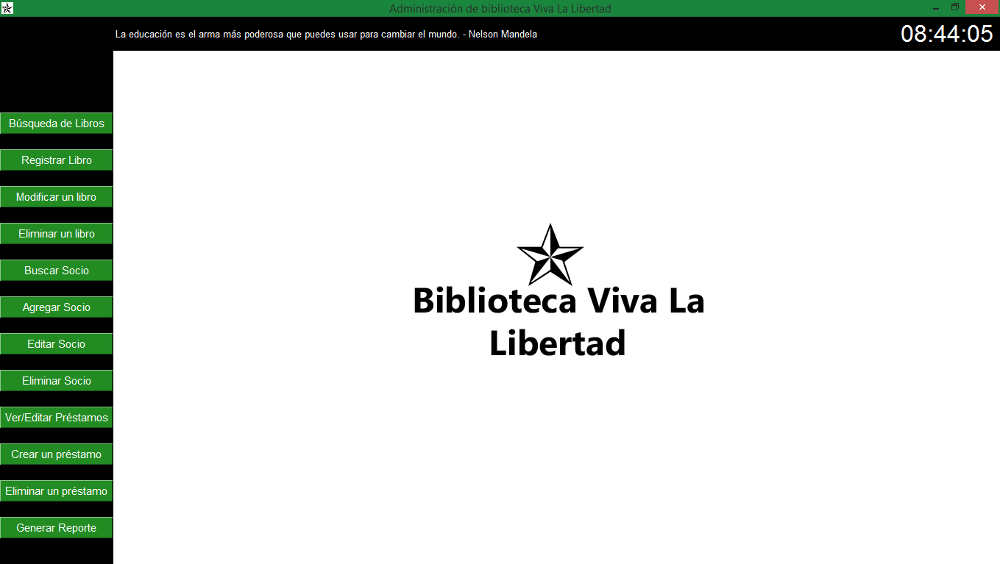

Conjunto completo de funciones y la interfaz gráfica para administrar una biblioteca. 

1. Búsqueda de Libros: Permite buscar libros por título, autor o género.
2. Registro de Libros: Permite agregar nuevos libros al sistema.
3. Modificación de Libros: Permite modificar detalles de libros existentes.
4. Eliminación de Libros: Permite eliminar libros del sistema.
5. Búsqueda de Socios: Permite buscar socios por nombre.
6. Registro de Socios: Permite agregar nuevos socios al sistema.
7. Edición de Socios: Permite buscar y editar detalles de socios.
8. Eliminación de Socios: Permite eliminar socios del sistema.
9. Visualización de Préstamos Registrados: Muestra una lista de préstamos activos.
10. Visualización de Devoluciones Registradas: Muestra una lista de devoluciones realizadas.
11. Reporte de Socios con Préstamos Activos: Muestra los socios que tienen préstamos activos.
12. Registro de Préstamos: Permite registrar nuevos préstamos.
13. Registro de Devoluciones: Permite registrar la devolución de libros prestados.

Cada función está integrada en una interfaz gráfica de usuario (GUI) utilizando Tkinter, y proporciona una forma interactiva y visualmente atractiva de interactuar con la base de datos de la biblioteca. 

Estructura del proyecto ..... proximamente a escalar intentaremos modularizar en la siguente estructura

biblioteca/
│
├── data/
│   ├── frases.json
│   ├── libros.json
│   ├── prestamos.json
│   ├── socios.json
│
├── img/
│   ├── ico.png
│   ├── logo.png
│ 
│  
├── src/
│   ├── gestion_libros.py
│   ├── gestion_prestamos.py
│   ├── gestion_socios.py
│   ├── interfaz.py
│
├── otros
│   ├── logo.psd
│   ├── requisitos.pdf
│
└──README.md

