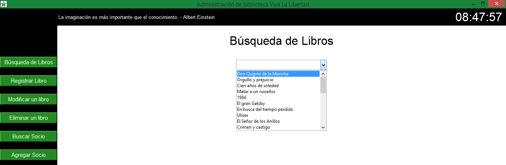
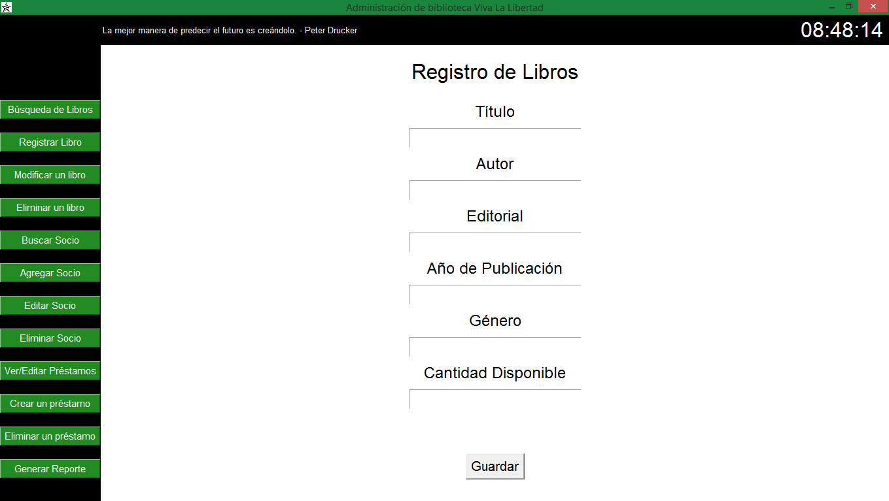
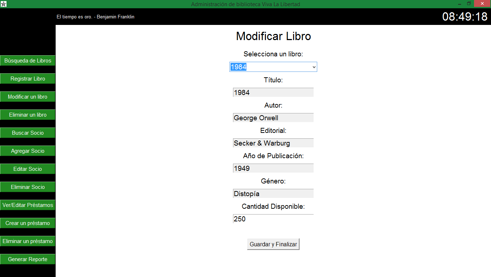
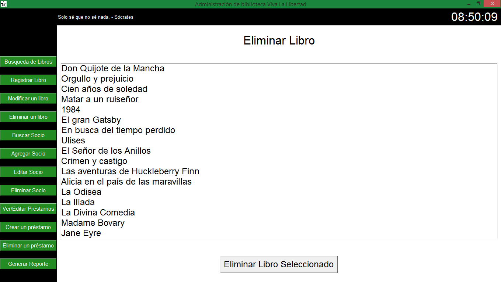
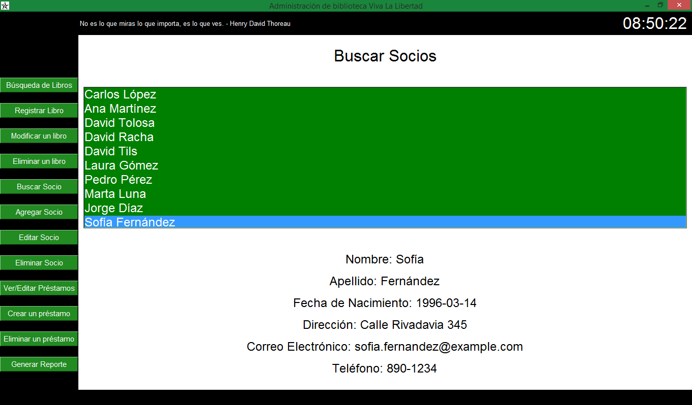
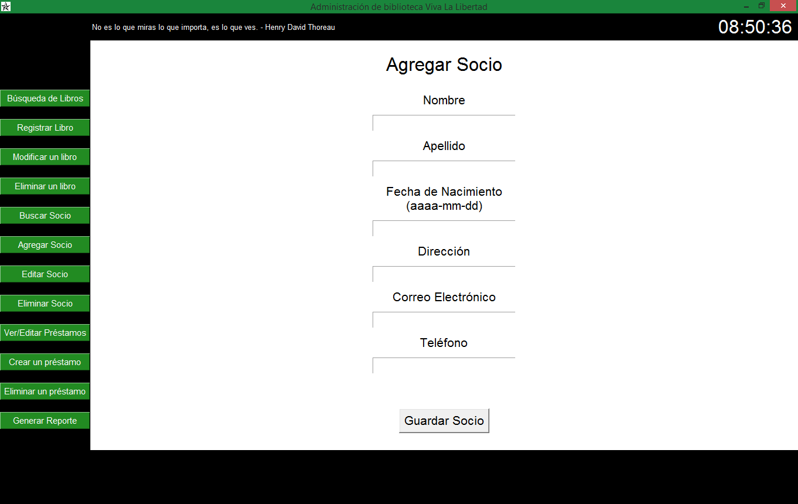
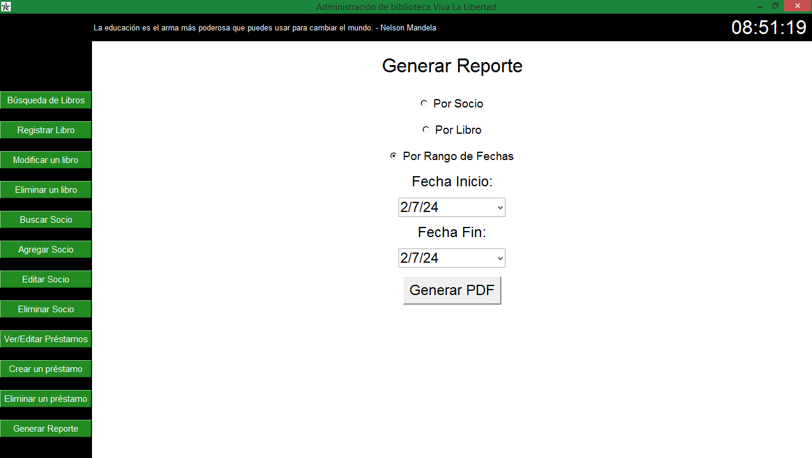
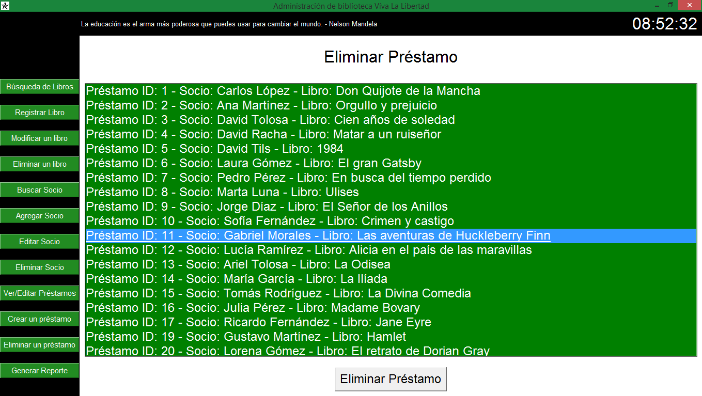
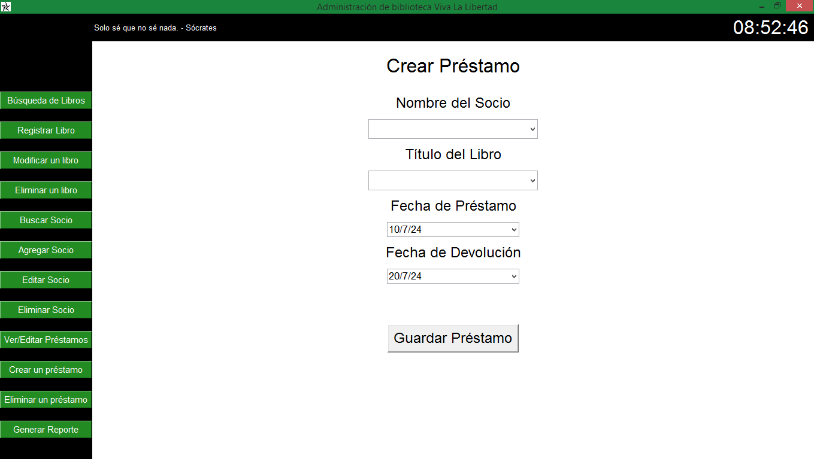
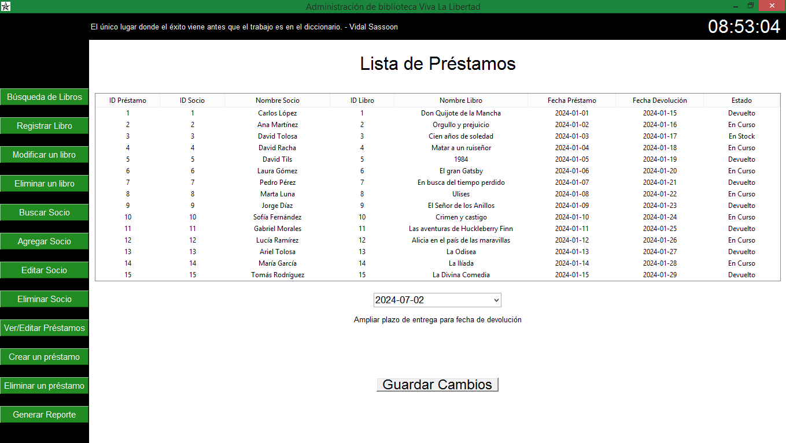

Nombre del proyecto: Biblioteca pública Viva la Libertad

 Lenguajes de programación y tecnologías empleadas en el desarrollo del proyecto
🔥 Python

Requisitos
1. Búsqueda de Libros: Permite buscar libros por título, autor o género.
2. Registro de Libros: Permite agregar nuevos libros al sistema.
3. Modificación de Libros: Permite modificar detalles de libros existentes.
4. Eliminación de Libros: Permite eliminar libros del sistema.
5. Búsqueda de Socios: Permite buscar socios por nombre.
6. Registro de Socios: Permite agregar nuevos socios al sistema.
7. Edición de Socios: Permite buscar y editar detalles de socios.
8. Eliminación de Socios: Permite eliminar socios del sistema.
9. Visualización de Préstamos Registrados: Muestra una lista de préstamos activos.
10. Visualización de Devoluciones Registradas: Muestra una lista de devoluciones realizadas.
11. Reporte de Socios con Préstamos Activos: Muestra los socios que tienen préstamos activos.
12. Registro de Préstamos: Permite registrar nuevos préstamos.
13. Registro de Devoluciones: Permite registrar la devolución de libros prestados.

Cada función está integrada en una interfaz gráfica de usuario (GUI) utilizando Tkinter, y proporciona una forma interactiva y visualmente atractiva de interactuar con la base de datos de la biblioteca. 

Librerías necesarias para correr el programa, ejecutando main.py
Reportlab,Ujson y Tkcalendar,se pueden instalar con la siguiente línea en la consola --> pip install reportlab ujson tkcalendar

